# SPayments

## Como rodar o projeto

### Pré-requisitos

Antes de prosseguir, certifique-se de ter o Docker e o Docker Compose instalados em sua máquina. Se você ainda não os tem instalados, você pode obtê-los [aqui](https://docs.docker.com/get-docker/) e [aqui](https://docs.docker.com/compose/install/).

### Configuração das Variáveis de Ambiente

Para executar o projeto com sucesso, você precisará configurar as seguintes variáveis de ambiente:

1. `POSTGRES_USER`: O nome de usuário para o banco de dados PostgreSQL.
2. `POSTGRES_PASSWORD`: A senha para o usuário do PostgreSQL.
3. `POSTGRES_DB`: O nome do banco de dados que será usado pelo aplicativo Django.
4. `DB_PORT`: A porta na qual o banco de dados PostgreSQL será exposto.

Certifique-se de definir essas variáveis de ambiente antes de executar o Docker Compose para evitar problemas de configuração.

### Iniciando o Projeto

Siga as etapas abaixo para configurar e iniciar o projeto:

1. Clone o repositório do projeto para o seu ambiente local.

    ```bash
    git clone https://github.com/L-M-Digital/SPay/tree/main
    cd Spay
    ```

2. Crie um arquivo `.env` no diretório raiz do projeto para armazenar suas variáveis de ambiente. Você pode usar o seguinte modelo:

    ```plaintext
    POSTGRES_USER=seu_usuario
    POSTGRES_PASSWORD=sua_senha
    POSTGRES_DB=seu_banco_de_dados
    DB_PORT=sua_porta
    ```

3. Execute o Docker Compose para criar os contêineres do aplicativo Django e do banco de dados PostgreSQL:

    ```bash
    docker-compose up -d
    ```

4. Após o processo de criação estar concluído, você pode acessar o aplicativo em `http://localhost:8000` em seu navegador.

### Encerrando o Projeto

Para encerrar o projeto e parar os contêineres Docker, você pode executar o seguinte comando:

```bash
docker-compose down
```

## HTTPS e SSL

O aplicativo Django é configurado para usar HTTPS e SSL por padrão. Para que isso funcione, você precisará gerar um certificado SSL e uma chave privada e colocá-los no diretório `nginx`. Você pode usar o seguinte comando para gerar um certificado e uma chave privada:

```bash
openssl req -x509 -nodes -days 365 -newkey rsa:2048 -keyout nginx/ssl_certificate.key -out nginx/ssl_certificate.crt
```

### Permission

As permissões do aplicativo seguem o seguinte fluxograma:

```mermaid
graph TD

subgraph PaymentCreateView
A[PaymentCreateView] -->|Endpoint: //create| B[IsAuthenticated]
B -->|Yes| C[IsPartner]
B -->|Yes| D[IsDirector]
C -->|Yes| E[Allow]
D -->|Yes| E
E -->|Allow| F[Create Payment]
F -->|Success| G[Response: 200]
G -->|Response| H[Log Request & Response]
H -->|Log| I[END]

B -->|No| J[Deny]
J -->|Deny| I[END]

C -->|No| J

D -->|No| J

end

subgraph PaymentListView
K[PaymentListView] -->|Endpoint: /list| L[IsAuthenticated]
L -->|Yes| M[IsPartner]
L -->|Yes| N[IsAccountant]
M -->|Yes| O[Allow]
N -->|Yes| O
O -->|Allow| P[List Payments]
P -->|Success| Q[Response: 200]
Q -->|Response| R[Log Request & Response]
R -->|Log| S[END]

L -->|No| T[Deny]
T -->|Deny| S[END]

M -->|No| T

N -->|No| T

end


```


