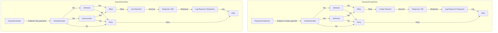

# SPayments

### Permission

As permissões do aplicativo seguem o seguinte fluxograma:

```mermaid
graph TD

subgraph PaymentCreateView
A[PaymentCreateView] -->|Endpoint: /create_payment| B[IsAuthenticated]
B -->|Yes| C[IsPartner]
B -->|Yes| D[IsDirector]
C -->|Yes| E[Allow]
D -->|Yes| E
E -->|Allow| F[Create Payment]
F -->|Success| G[Response: 200]
G -->|Response| H[Log Request & Response]
H -->|Log| I[END]

B -->|No| J[Deny]
J -->|Deny| I[END]

C -->|No| J

D -->|No| J

end

subgraph PaymentListView
K[PaymentListView] -->|Endpoint: /list_payments| L[IsAuthenticated]
L -->|Yes| M[IsPartner]
L -->|Yes| N[IsAccountant]
M -->|Yes| O[Allow]
N -->|Yes| O
O -->|Allow| P[List Payments]
P -->|Success| Q[Response: 200]
Q -->|Response| R[Log Request & Response]
R -->|Log| S[END]

L -->|No| T[Deny]
T -->|Deny| S[END]

M -->|No| T

N -->|No| T

end


```
